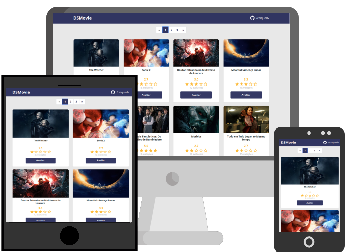

<h1 align="center">Avaliação de filmes em cartaz</h1>

  

<h2>:rocket: Tecnologias Usadas</h2>

  
  
  
  

<h2>:computer: Projeto</h2>
Projeto desenvolvido para fins de estudo. O layout foi passado durante a semana de demonstração do curso
Dev Superior e as novas features implementadas por <a href="https://github.com/caiquedv">Caique Andrade</a>. 
 
A primeira versão tinha um HTML gigante que foi reduzido ao mínimo usando JavaScript, criando um modelo de card
e clonando conforme os filmes disponíveis no arquivo JSON, que simula a resposta de uma API, 
tornando dinamica a renderização. O algoritmo de páginação, também em JavaScript, segue o mesmo 
princípio de clonagem dinânimca.
 
Ao clicar em "Avaliar" será aberta uma nova janela com o formulário de avaliação que é construído a partir do 
id enviado junto ao clique através do <b>localStorage</b>. Ao clicar em "Salvar" , o localStorage será atualizado
e através de um listener automaticamente atualizará a página princípal com a nova avaliação.
 
O projeto é responsivo e conta com algoritmos de avaliação de 5 estrelas e validação nativa.

<h2>:eyes: Deploy</h2>

Veja o projeto em [GitHub Pages](https://caiquedv.github.io/portfolio_dsmovie/).
